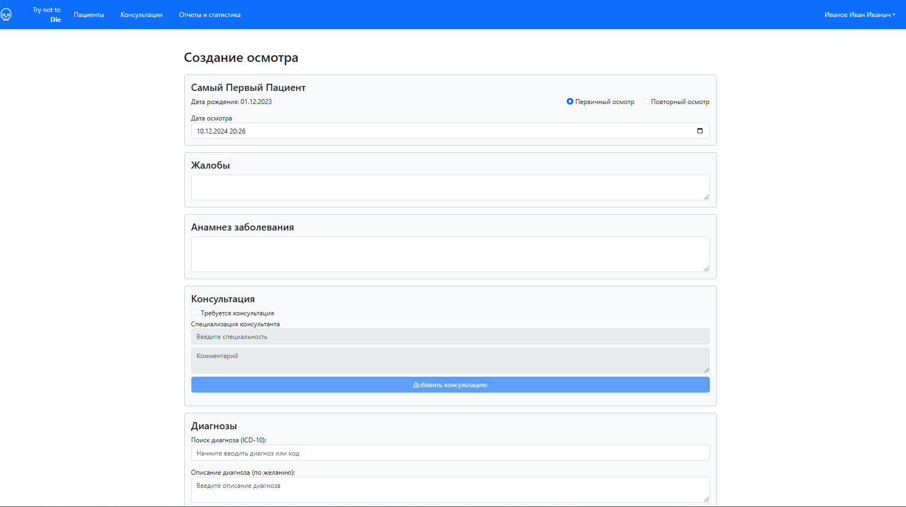

## Медицинская система управления осмотрами пациентов и консультациями.

### Описание

Веб-приложение предназначено для врачей, обеспечивая удобное управление информацией о пациентах, осмотрах и консультациях. Система поддерживает функции просмотра, добавления и редактирования данных, а также генерацию отчётов для анализа статистики.

### Основные возможности
- **Управление профилем доктора**: Просмотр своего профиля, возможность менять основную информацию о себе.
- **Управление пациентами**: Просмотр списка пациентов с возможностью просмотра подробной информации о каждом пациенте.
- **Управление осмотрами пациентов**: Возможность смотреть и добавлять осмотры для пациентов.
- **Детали осмотра**: Полная информация об осмотре, включая дату, жалобы, анамнез, диагнозы, рекомендации и заключение и возможность редактировать это врачу-автору.
- **Работа с диагнозами МКБ-10**: Поиск и выбор диагнозов из справочника МКБ-10 для каждого осмотра и др страниц.
- **Управление консультациями**: Просмотр и редактирование данных консультаций, возможность оставлять комментарии(консультации) к осмотру.
- **Отчеты и статистика**: Генерация отчётов по количеству посещений пациентов, связанных с диагнозами, с фильтрацией по дате и корням МКБ-10.

### Технологии

- **Frontend**: HTML, JavaScript, Bootstrap
- **Backend API**: Взаимодействие с внешним API для работы с данными о пациентах и осмотрах
- **lite-server**: Маршрутизация.(npm install, npx lite-server)
### Скриншоты

#### Пример страницы авторизации

#### Пример страницы регистрации

#### Пример профиля пользователя

#### Пример страницы управления пациентами на широком экране в 2 колонки(тз заказчика).

#### Пример создания пациента

#### Управление пациентов на узком экране(мобильные устройства), в 1 колонку. Желание оставить шапку сверху целиком с надписями-желание заказчика. 
 

#### Пример карты пациента

#### Пример страницы создания нового осмотра. Кнопка редактирования осмотра существует, если этот осмотр создан данным врачом. Комментарии может оставлять врач-автор и врач, который соответствует специальности врача, который необходим для консультации. 

#### Пример страницы управления консультациями

#### Пример деталей осмотра

#### Пример отчётов и статистики

